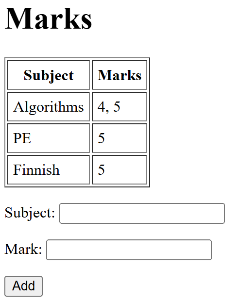
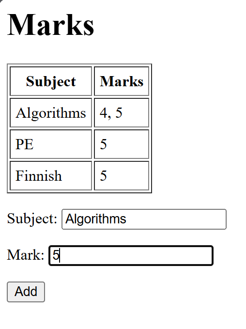
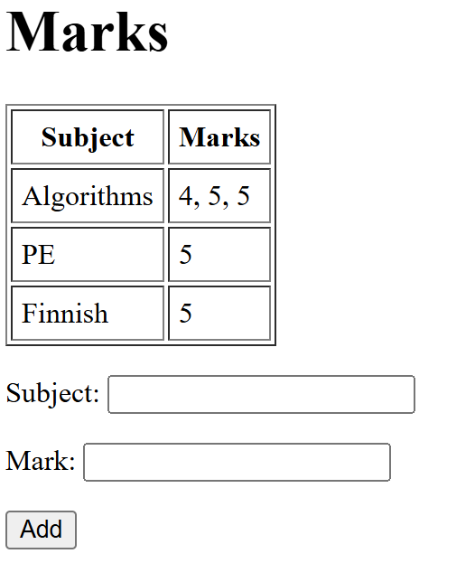

# Лабораторная работа №1: Работа с сокетами

## Цель работы
Научиться работать с сетевыми сокетами (UDP, TCP, HTTP) и реализовать клиент-серверные программы.

## Задание 1: UDP

Сокет  
: Программный интерфейс для сетевого обмена данными.  
: Представляет конечную точку связи — сочетание IP-адреса, порта и протокола (TCP или UDP).  
: Через сокеты процессы на разных компьютерах (или на одном) могут отправлять и принимать данные.  
: В Python создаётся функцией `socket.socket()`.  

UDP (User Datagram Protocol)  
: Транспортный протокол без установления соединения.  
: Быстрее, чем TCP, но не гарантирует доставку сообщений и их порядок.  
: Использует датаграммы — отдельные пакеты, каждый передаётся самостоятельно.  
: В Python клиент отправляет данные с помощью `sendto()`, а сервер получает через `recvfrom()`.  
: Подходит для простых обменов, где потеря некоторых пакетов некритична (например, видео, аудио или учебные примеры).


В этом задании я реализовала клиентскую и серверную часть приложения, используя протокол UDP и библиотеку socket:

###Код серверной части:
```
import socket

HOST = "127.0.0.1"   # local adr
PORT = 30114         # port

sock = socket.socket(socket.AF_INET, socket.SOCK_DGRAM)
sock.bind((HOST, PORT))

print(f"UDP server is launched on {HOST}:{PORT}")

while True:
    data, addr = sock.recvfrom(1996)
    print(f"Received from {addr}: {data.decode()}")

    if data:
        response = "Hello, client"
        sock.sendto(response.encode(), addr)  # answer sending
```

1. Создаётся UDP-сокет с параметрами `AF_INET` (IPv4) и `SOCK_DGRAM` (UDP).  
2. Сокет привязывается к адресу `127.0.0.1` и порту `30114` с помощью `bind()`.  
3. В бесконечном цикле сервер:
   - получает сообщение от клиента функцией `recvfrom()`,  
   - выводит полученные данные в консоль,  
   - формирует строку ответа `"Hello, client"` и отправляет её клиенту через `sendto()`.  

Так сервер постоянно ждёт входящих сообщений и на каждое отвечает фиксированной строкой.

###Код клиентского приложения:
```
import socket

SERVER_HOST = "127.0.0.1"
SERVER_PORT = 30114

sock = socket.socket(socket.AF_INET, socket.SOCK_DGRAM)

message = "Hello, server"
sock.sendto(message.encode(), (SERVER_HOST, SERVER_PORT))
print(f"Sent to the server: {message}")

data, addr = sock.recvfrom(1996)
print(f"The answer from server{data.decode()}")

sock.close()
```

1. Создаётся UDP-сокет.  
2. Клиент формирует строку `"Hello, server"` и отправляет её на сервер функцией `sendto()`.  
3. Получает ответ от сервера функцией `recvfrom()`.  
4. Выводит полученные данные в консоль и закрывает соединение с помощью `close()`.  


## Задание 2: TCP

TCP (Transmission Control Protocol)  
: Транспортный протокол с установлением соединения.  
: Обеспечивает надёжную передачу данных: гарантирует доставку и порядок байтов.  
: Работает как поток — границ сообщений нет, приложение само должно решать, где заканчивается одно сообщение и начинается другое.  
: Подходит там, где важна точность (например, веб-страницы, файлы, базы данных).  

Сокет в TCP  
: Сервер создаёт сокет, привязывает его к адресу (`bind()`), переводит в режим ожидания (`listen()`) и ждёт клиентов (`accept()`).  
: `accept()` блокируется до подключения клиента и возвращает **новый сокет** для общения только с ним.  
: Клиент создаёт сокет и подключается к серверу через `connect()`.  
: Обмен данными выполняется с помощью `sendall()` (отправка) и `recv()` (получение).  

Различие TCP и UDP  
: TCP устанавливает соединение, надёжный и потоковый, но работает медленнее.  
: UDP — без соединения, быстрее, но не гарантирует доставку и порядок сообщений.  

###Код серверного приложения
```
import socket

HOST = "127.0.0.1"
PORT = 30114

# TCP-server socket
server_socket = socket.socket(socket.AF_INET, socket.SOCK_STREAM)
server_socket.bind((HOST, PORT))
server_socket.listen(1)

print(f"TCP server is launched on {HOST}:{PORT}, waiting for connection...")

while True:
    conn, addr = server_socket.accept()
    print(f"Client is connected: {addr}")

    data = conn.recv(1996).decode()
    print(f"Received: {data}")

    try:
        a, b, h = map(float, data.split())
        result = (a + b) / 2 * h
        response = f"Trapezoid square: {result}"
    except Exception as e:
        response = f"Error: {e}"

    conn.sendall(response.encode())
    conn.close()
```

1. Создаётся TCP-сокет.
2. Сокет привязывается к IP-адресу и порту.
3. Переводится в режим ожидания подключений (listen()).
4. В цикле ожидается клиентское подключение (accept()):  
> при подключении принимаются данные от клиента;  
> выполняется вычисление площади по полученным параметрам;  
> результат передаётся клиенту.  
5. Соединение закрывается, после чего сервер продолжает ожидание новых подключений.

###Код клиентского приложения:

```
import socket

HOST = "127.0.0.1"
PORT = 30114

client_socket = socket.socket(socket.AF_INET, socket.SOCK_STREAM)
client_socket.connect((HOST, PORT))

a = input("Enter base a: ")
b = input("Enter base b: ")
h = input("Enter height h: ")

message = f"{a} {b} {h}"
client_socket.sendall(message.encode())

data = client_socket.recv(1996).decode()
print("Answer from server:", data)

client_socket.close()

```

1. Создаётся TCP-сокет.
2. Происхходит подключение к серверу по адресу 127.0.0.1 и порту 30114.
3. Запрос у пользователя: основание a, основание b и высота h.
4. Формирование строки с этими значениями и отправка серверу через sendall().
5. Получение от сервера строки-ответа (с вычисленной площадью трапеции) с помощью recv().
6. Вывод результата в консоль.
7. Закрытие соединения вызовом close().

Таким образом клиент собирает исходные данные от пользователя, передаёт их серверу и получает обратно вычисленный результат.


## Задание 3: HTTP

HTTP (HyperText Transfer Protocol)  
: Представляет собой прикладной протокол, используемый для передачи гипертекста (обычно HTML-страниц).  
: Работает поверх TCP.  
: Клиентом, как правило, выступает браузер, который формирует запросы.  
: Сервер принимает запрос, формирует и возвращает ответ.  

Структура HTTP-запроса  
: Включает стартовую строку (например, `GET / HTTP/1.1`), набор заголовков (например, `Host`, `User-Agent`), пустую строку и (для POST-запросов) тело.  

Структура HTTP-ответа  
: Состоит из статусной строки (например, `HTTP/1.1 200 OK`), заголовков (`Content-Type`, `Content-Length`), пустой строки и тела ответа (HTML-кода).  

Особенности реализации HTTP-сервера  
: Запрос читается через `recv()`, после чего формируется минимальный HTTP-ответ.  
: В заголовках обязательно указывается `Content-Type`, чтобы браузер корректно отобразил страницу.  
: В качестве тела ответа используется содержимое HTML-файла или заранее заданная строка.

###Код серверного приложения

```
import socket

HOST = "127.0.0.1"
PORT = 1996

server_socket = socket.socket(socket.AF_INET, socket.SOCK_STREAM)
server_socket.bind((HOST, PORT))
server_socket.listen(1)

print(f"HTTP is running on http://{HOST}:{PORT}")

while True:
    conn, addr = server_socket.accept()
    print("Connected:", addr)

    request = conn.recv(1024).decode()
    print("=== HTTP Request ===")
    print(request)

    # Загрузка HTML из файла
    try:
        with open("index.html", "r", encoding="utf-8") as f:
            body = f.read()
    except FileNotFoundError:
        body = "<html><body><h1>File index.html is not found</h1></body></html>"

    # Формирование HTTP-ответа
    response = (
        "HTTP/1.1 200 OK\r\n"
        "Content-Type: text/html; charset=utf-8\r\n"
        f"Content-Length: {len(body.encode())}\r\n"
        "\r\n"
        f"{body}"
    )

    conn.sendall(response.encode())
    conn.close()

```

1. Создаётся TCP-сокет с параметрами `AF_INET` и `SOCK_STREAM`.  
2. Сокет привязывается к адресу `127.0.0.1` и порту `1996`.  
3. Переводится в режим ожидания подключений с помощью метода `listen()`.  
4. В бесконечном цикле выполняются следующие действия:  
   > Ожидается подключение клиента (`accept()`), создаётся новый сокет для взаимодействия.  
   > От клиента принимается HTTP-запрос функцией `recv()`, содержимое запроса выводится в консоль.  
   > Осуществляется попытка загрузки HTML-страницы из файла `index.html`.  
   > Если файл отсутствует, в качестве тела ответа используется HTML-заглушка.  
   > Формируется корректный HTTP-ответ, включающий статусную строку, заголовки (`Content-Type`, `Content-Length`) и тело с HTML-кодом.  
   > Ответ передаётся клиенту методом `sendall()`.  
   > Соединение с данным клиентом закрывается.

В качестве клиента используется **веб-браузер**: при обращении к адресу `http://127.0.0.1:1996` он формирует HTTP-запрос и отображает полученный от сервера HTML-ответ.


## Задание 4: Чат

Чат на основе сокетов  
: Реализуется по принципу "один сервер — несколько клиентов".  
: Сервер принимает подключения от пользователей и обеспечивает пересылку сообщений между ними.  
: Для каждого клиента создаётся отдельный поток или процесс, который обрабатывает его сообщения.  
: Все полученные от клиента сообщения пересылаются (рассылаются) остальным участникам чата.  

Особенности реализации  
: Сервер хранит список активных клиентов.  
: При поступлении сообщения от одного клиента оно передаётся всем остальным с помощью функции-ретранслятора (broadcast).  
: При отключении клиента он удаляется из списка активных подключений.  
: Для одновременной работы с несколькими клиентами используется многопоточность (модуль `threading`) или асинхронное программирование.

###Код серверного приложения
```
import socket
import threading

HOST = "127.0.0.1"
PORT = 30114

clients = []

def handle_client(conn, addr):
    print(f"Connected {addr}")
    while True:
        try:
            msg = conn.recv(1996).decode()
            if not msg:
                break
            print(f"{addr}: {msg}")
            broadcast(msg, conn)
        except:
            break
    conn.close()
    clients.remove(conn)
    print(f"{addr} disconnected")

def broadcast(message, sender_conn):
    for client in clients:
        if client != sender_conn:
            client.sendall(message.encode())

server_socket = socket.socket(socket.AF_INET, socket.SOCK_STREAM)
server_socket.bind((HOST, PORT))
server_socket.listen()
print(f"Chat-server is running on {HOST}:{PORT}")

while True:
    conn, addr = server_socket.accept()
    clients.append(conn)
    thread = threading.Thread(target=handle_client, args=(conn, addr))
    thread.start()
```

1. Создаётся TCP-сокет.  
2. Сокет привязывается к IP-адресу и порту.  
3. Переводится в режим ожидания подключений (`listen()`).  
4. В бесконечном цикле:  
> ожидается подключение нового клиента (`accept()`);  
> создаётся отдельный поток для обработки сообщений данного клиента;  
> поток принимает входящие сообщения и вызывает функцию `broadcast` для рассылки текста всем остальным клиентам;  
> при отключении клиента соединение закрывается, а он удаляется из списка активных подключений.  

###Код клиентского приложения
```
import socket
import threading

HOST = "127.0.0.1"
PORT = 30114

def receive(sock):
    while True:
        try:
            msg = sock.recv(1996).decode()
            if msg:
                print("\nMessage:", msg)
        except:
            break

sock = socket.socket(socket.AF_INET, socket.SOCK_STREAM)
sock.connect((HOST, PORT))

# stream for getting messages
thread = threading.Thread(target=receive, args=(sock,))
thread.start()

print("Connected to the chat! Enter your message:")

while True:
    msg = input()
    sock.sendall(msg.encode())
```

1. Создаётся TCP-сокет.  
2. Выполняется подключение к серверу (`connect()`).  
3. Запускается отдельный поток для получения входящих сообщений и их отображения в консоли.  
4. В основном цикле клиент вводит сообщения с клавиатуры.  
5. Каждое введённое сообщение отправляется серверу.  
6. Соединение может быть закрыто пользователем или при разрыве связи.  

Таким образом, чат позволяет нескольким клиентам одновременно обмениваться сообщениями через сервер, который выступает посредником и рассылает их всем участникам.


## Задание 5: Мини веб-сервер
Веб-сервер с поддержкой GET и POST  
: Реализуется на основе TCP-сокета.  
: Обрабатывает HTTP-запросы браузера и формирует HTML-страницу с данными.  
: Поддерживает два метода:  
  - **GET** — используется для запроса страницы и отображения текущих данных.  
  - **POST** — применяется для передачи информации от клиента (например, отправки формы).  

Особенности реализации  
: При обработке POST-запроса тело сообщения парсится, и данные добавляются к общему списку/словарю.  
: HTML-страница формируется динамически: отображаются все накопленные данные и форма для добавления новых.  
: Для разбора параметров используется функция `urllib.parse.parse_qs`.  
: Сервер простейший, поэтому данные сохраняются только в оперативной памяти.  

###Код серверной части

```
import socket
import urllib.parse

HOST = "127.0.0.1"
PORT = 30114

# использую словарь
grades = {}

server = socket.socket(socket.AF_INET, socket.SOCK_STREAM)
server.bind((HOST, PORT))
server.listen(1)

print(f"Server is running: http://{HOST}:{PORT}")

def build_page():
    rows = ""
    for subj, marks in grades.items():
        rows += f"<tr><td>{subj}</td><td>{', '.join(marks)}</td></tr>"
    return f"""
    <html><body>
        <h1>Marks</h1>
        <table border="1" cellpadding="5">
            <tr><th>Subject</th><th>Marks</th></tr>
            {rows}
        </table>
        <form method="POST">
            <p>Subject: <input name="subject"></p>
            <p>Mark: <input name="mark"></p>
            <p><input type="submit" value="Add"></p>
        </form>
    </body></html>
    """

while True:
    conn, addr = server.accept()
    request = conn.recv(2002).decode()

    headers, _, body = request.partition("\r\n\r\n")
    if request.startswith("POST"):
        params = urllib.parse.parse_qs(body)
        subj = params.get("subject", [""])[0]
        mark = params.get("mark", [""])[0]
        if subj and mark:
            grades.setdefault(subj, []).append(mark)

    page = build_page()
    response = "HTTP/1.1 200 OK\r\nContent-Type: text/html; charset=utf-8\r\n\r\n" + page
    conn.sendall(response.encode())
    conn.close()
```

1. Создаётся TCP-сокет и привязывается к адресу `127.0.0.1:30114`.  
2. Сервер переводится в режим ожидания подключений.  
3. В качестве хранилища используется словарь `grades`, где ключом является предмет, а значением — список оценок.  
4. На каждом новом подключении принимается HTTP-запрос.  
5. При использовании метода `POST` тело запроса разбирается с помощью `urllib.parse.parse_qs()`, и данные добавляются в словарь.  
6. HTML-страница формируется функцией `build_page()` (таблица с текущими оценками и форма для добавления новых).  
7. Клиенту отправляется HTTP-ответ со статусом `200 OK`, заголовком `Content-Type: text/html; charset=utf-8` и телом HTML-страницы.  
8. Соединение закрывается.

Добавление оценок пользователь может производить непосредственно на странице в браузере. Каждое действие пользователя обрабатывается как отдельный HTTP-запрос.  

- При открытии страницы в браузере формируется **HTTP GET-запрос**.  
  Сервер принимает его, собирает HTML-страницу и отправляет обратно.  
  После этого соединение с клиентом закрывается (`conn.close()`).  

- При добавлении новой оценки через форму браузер отправляет **HTTP POST-запрос**.  
  Сервер принимает данные, обновляет словарь `grades`, формирует HTML-страницу с обновлёнными значениями и отправляет её клиенту.  
  Сразу после отправки ответного сообщения соединение снова закрывается (`conn.close()`).  


Таким образом, в реализации сервера каждое взаимодействие (просмотр страницы или добавление оценки) обрабатывается в рамках нового соединения.

<p float="left">
  
  
  
</p>


## Выводы
В ходе выполнения лабораторной работы я реализовала пять заданий, связанных с использованием сокетов в Python.  
На практике изучила основные протоколы транспортного уровня (UDP и TCP), а также принципы работы HTTP и взаимодействия клиента и сервера.  
Дополнительно был реализован многопользовательский чат и веб-сервер с обработкой GET- и POST-запросов.

До выполнения этой работы опыт написания серверных приложений на Python у меня отсутсвовал.  
В процессе выполнения заданий удалось разобраться в базовых функциях модуля `socket`, освоить структуру HTTP-запросов и ответов.  
Кроме того, была получена практика работы с потоками (для чата) и динамическим формированием HTML-страниц (для веб-сервера).

Таким образом, благодаря лабораторной работе были приобретены первоначальные навыки разработки сетевых приложений на Python.

